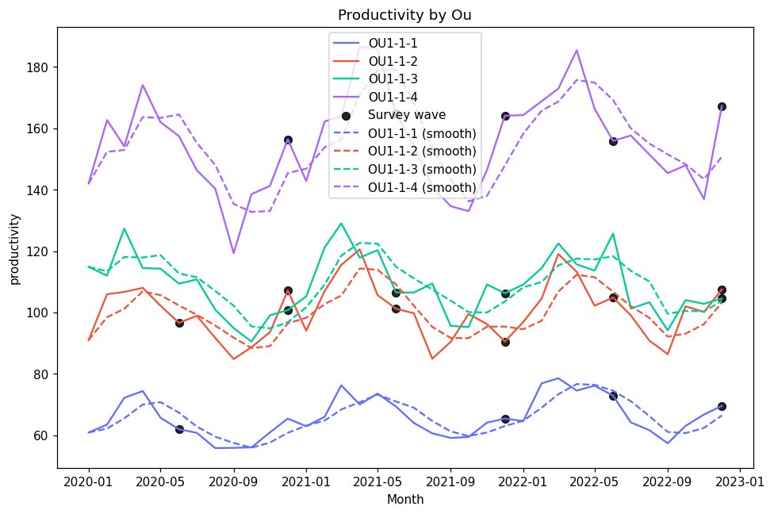
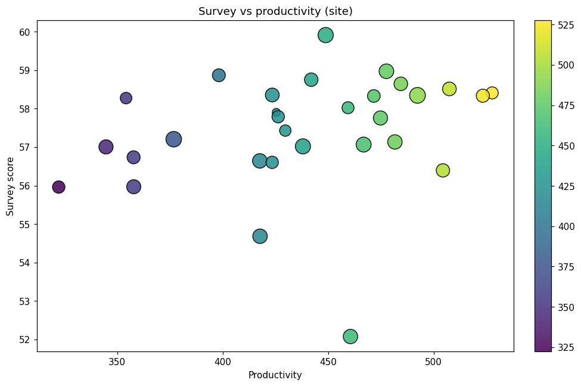
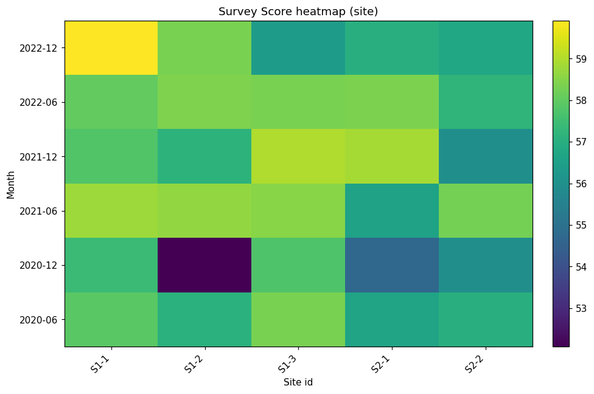
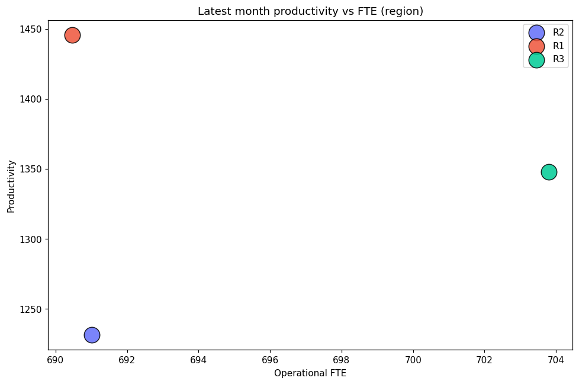

# Synthetic Hierarchical Report

- Seed: `42`
- Rows: `1,296`

Generated visuals:

## Productivity trend

> File size: 141.3 KiB

## Survey vs productivity

> File size: 54.6 KiB

## Survey heatmap

> File size: 29.0 KiB

## Productivity vs FTE

> File size: 29.2 KiB
